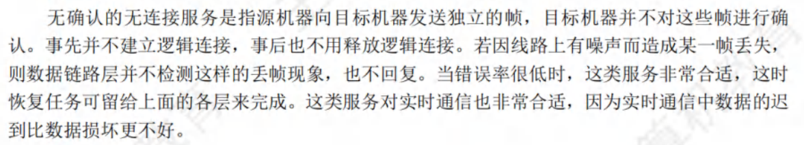

# 3.1数据链路层的功能
- 为防止在传输过程中帧丢失，在可靠的数据链路层协议中，发送方对发送的每个数据帧设计一个计时器，当计时器到期而该帧的确认帧仍未到达时，发送方将重发该帧。为保证接收方不会接收到重复帧，需要对每个发送的帧进行编号:海明码和循环冗余检验码都用于差错控制。
- 对于信道比较可靠且对实时性要求高的网络，数据链路层采用无确认的无连接服务比较合适 
- 数据链路层的标准协议有[HDLC,PPP,SLIP](https://www.doubao.com/thread/a3ab0b18fdb08)(ICMP是网络层协议)
# 3.2组帧
- **字符计数法**是指在帧首部使用一个计数字段来记录该帧所含的字节数(包括计数字段自身所占用的1个字节) 
**字节填充法**使用特定字节来定界一帧的开始与结束,eg:SOH表示开始,EOT表示结束 
**零比特填充法**使用一个特定的比特串 01111110 来标志一帧的开始与结束(每遇到5个连续的“1”，就自动在其后插入一个“0”) 
**违规编码法**eg:曼彻斯特编码方法将数据比特“1”编码成“高-低”电平对，将数据比特“0”编码成“低-高”电平对，而“高-高”电平对和“低-低”电平对在数据比特中是违规的(即没有采用)，因此可借用这些违规编码序列来定界帧的开始与结束
# 3.3差错控制
- **奇偶检验码**是奇检验码(数据中1的个数是奇数)和偶检验码(数据中1的个数是偶数)的统称
- **循环冗余码**:双方约定一个多项式eg:$x^{3}+x^{2}+1(1101)$,发送方把数据除以这个1101,然后把余数附加到数据后边发出去;接收方把收到的数据除以1101,如果没有出错那么刚好除尽 循环冗余码(CRC)是具有纠错功能的，只是数据链路层仅使用了它的检错功能
- [**海明码**](https://www.bilibili.com/video/BV1GF411V7sC?vd_source=c6d2d8c637bc4cf341d83587cc4b4b54):以0~15为例 
  >0:对整个盘面进行纠错; 
    1:对1,3,5,7,...,15进行纠错 
    2:对2,3,6,7,10,11,14,15进行纠错 
    4:对4,5,6,7,12,13,14,15进行纠错 
    8:对8~15进行纠错; 
  >海明码很像二分法,8对一半进行纠错,4对一半的一半进行纠错,2对一半的一半的一半进行纠错...

